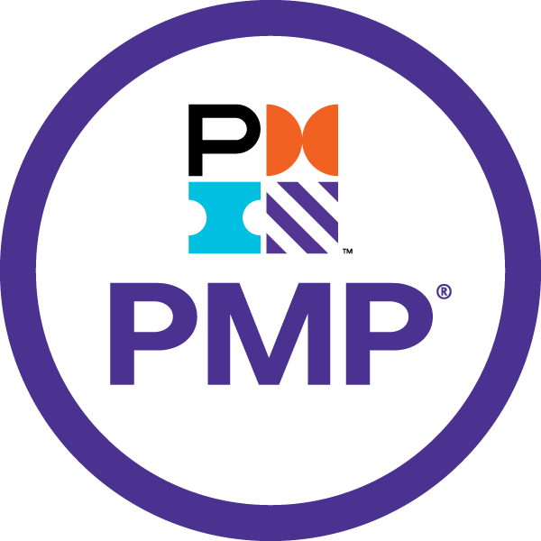

  

    

      
      <h1>Isaiah Butler</h1>
      

      
Software Engineer

      
    

    <section id="about" class="section" >
      

        <a href="#about" class="arrow-button"><i class="fas fa-chevron-down"></i></a>        
        <h2 class="section-title">About Me</h2>
        

      

      

        
Hi! 👋 I’m Isaiah Butler - a Technical Project Manager with a background in Software Development and a Master's in Computer Science. 🤖

        
I lead cross-functional teams to deliver user-focused software, on time and with impact.

        
I'm passionate about streamlining workflows, bridging technical and non-technical teams, and using technology to solve real-world problems.

        
From mobile apps to internal tools to AI-driven projects, I love building things that matter - and I’m always excited to learn more. 🤓

      

    </section>
    <section id="skills" class="section">
      

        <a href="#skills" class="arrow-button"><i class="fas fa-chevron-down"></i></a>
        <h2 class="section-title">Skills</h2>
        

      

      <h3 class="section-subtitle">Project Management – 3+ years</h3>
      

        

          <ul>
            <li><i class="fas fa-project-diagram"></i> Agile</li>
            <li><i class="fas fa-network-wired"></i> Scrum</li>
            <li><i class="fas fa-stream"></i> Waterfall</li>
            <li><i class="fab fa-jira"></i> Jira</li>
            <li><i class="fab fa-confluence"></i> Confluence</li>
            <li><i class="fab fa-trello"></i> Trello</li>
            <li><i class="devicon-azure-plain"></i> Azure</li>
          </ul>
        

        

          <ul>
            <li><i class="fas fa-users"></i> Team Leadership</li>
            <li><i class="fas fa-handshake"></i> Stakeholder Management</li>
            <li><i class="fas fa-shield-alt"></i> Risk Management</li>
            <li><i class="fas fa-user-check"></i> Client Communication</li>
          </ul>
        

        

          <ul>
            <li><i class="fas fa-chart-line"></i> Reports & Analytics</li>
            <li><i class="fas fa-gears"></i> Resource Planning</li>
            <li><i class="fas fa-lightbulb"></i> Decision-Making</li>
            <li><i class="fas fa-users-gear"></i> Cross-functional Collaboration</li>
            <li><i class="fas fa-tools"></i> Problem Solving</li>
          </ul>
        

      

      <h3 class="section-subtitle">Software Development – 8+ years</h3>
      

      

        <h4>Development</h4>
        <ul>
          <li><i class="fas fa-mug-hot"></i> Java</li>
          <li><i class="devicon-python-plain"></i> Python</li>
          <li><i class="devicon-c-plain"></i> C</li>
          <li><i class="devicon-cplusplus-plain"></i> C++</li>
          <li><i class="devicon-csharp-plain"></i> C#</li>
        </ul>
      

      

        <h4>AI/ML</h4>
        <ul>
          <li><i class="devicon-tensorflow-original"></i> TensorFlow</li>
          <li><i class="fas fa-k"></i> Keras</li>
          <li><i class="devicon-jupyter-plain"></i> Jupyter</li>
          <li><i class="devicon-pandas-plain"></i> Pandas</li>
          <li><i class="devicon-pytorch-original"></i> PyTorch</li>
          <li><i class="fas fa-brain"></i> NLP</li>
          <li><i class="fas fa-robot"></i> LLMs</li>
        </ul>
      

      

        <h4>Tools & Infrastructure</h4>
        <ul>
          <li><i class="fab fa-git-alt"></i> Git</li>
          <li><i class="fas fa-fire"></i> Firebase</li>
          <li><i class="fas fa-cloud"></i> Amazon S3</li>
          <li><i class="fas fa-credit-card"></i> Payments</li>
          <li><i class="fas fa-fingerprint"></i> Biometrics</li>
          <li><i class="devicon-embeddedc-plain"></i> Embedded Systems</li>
        </ul>
      

      
      
        <h4>Mobile Apps</h4>
        <ul>
          <li><i class="fab fa-android"></i> Android (Java/Kotlin)</li>
          <li><i class="fab fa-apple"></i> iOS (Objective-C)</li>
        </ul>
      

      

        <h4>Frontend</h4>
        <ul>
          <li><i class="fab fa-html5"></i> HTML</li>
          <li><i class="fab fa-css3-alt"></i> CSS</li>
          <li><i class="fab fa-js-square"></i> JavaScript</li>
        </ul>
      

      

        <h4>Backend</h4>
        <ul>
          <li><i class="fas fa-database"></i> MySQL</li>          
          <li><i class="fas fa-cloud"></i> AWS</li>
        </ul>
      

    

    </section>
    <section id="projects" class="section" >
      

        <a href="#projects" class="arrow-button"><i class="fas fa-chevron-down"></i></a>        
        <h2 class="section-title">Featured Projects</h2>
        

      

      

        

          <strong>Lawn Chop Chop: Robotic Lawnmower Simulation</strong> 
          <em>Scrum Master • UI/UX Designer</em>
          
Led an Agile team and designed a clean UI to simulate an autonomous lawnmower, featuring obstacle avoidance and smart shutdown, for non-technical stakeholders at Pegasus Inc. within a fixed 8-week timeline.

          <a class="button" href="#">More</a>
        

        
      

      

        
        

          <strong>UPRHS Course and Grade Management System</strong> 
          <em>Project Manager</em>
          
Managed development of a student portal for UP Rural High School, digitizing grades and streamlining registration for underserved communities in the Philippines.

          <a class="button" href="#">More</a>
        

      

      

        

          <strong>Smart Home System: Embedded IoT Controller</strong> 
          <em>Project Lead • Systems Designer</em>
          
Developed an STM32-based smart home system with automated locks, HVAC, lighting, fire alarm, security system, and a real-time clock, all managed through a keypad-driven interface.

          <a class="button" href="#">More</a>
        

        
      

    </section>
    <section id="certifications" class="section" >
      

        <a href="#certifications" class="arrow-button"><i class="fas fa-chevron-down"></i></a>        
        <h2 class="section-title">Professional Certifications</h2>
        

      

      

          
          

            <strong>Project Management Professional (PMP)®</strong> 
            <em>Project Management Institute</em> 
            In Progress — Expected June 2025
          

      

    </section>
    <section id="end" class="section" >
      

        <a href="#end" class="arrow-button"><i class="fas fa-chevron-down"></i></a>        
        <h2 class="section-title">Thanks!</h2>
        

      

    </section>
    <footer class="footer">
        
      
&copy; Isaiah Butler. 2026. All rights reserved.

    </footer>
  

